# Dynamic Split Screen

Two-player **online** co-op split screen for Unreal Engine 5.8, in the spirit of *It Takes Two*.
Both players see both views: their own character on one half and the other player's live camera
on the other half. Level volumes switch the screen between split and full view.

- Unreal Engine **5.8** · Win64 · Listen server, 2 players · Network replicated
- Runtime module: `DynamicSplitScreen` · no third-party dependencies
- Video: https://www.youtube.com/watch?v=Sr370iMZrtE
- PDF manual: [Docs/DynamicSplitScreen_Manual.pdf](Docs/DynamicSplitScreen_Manual.pdf)

| Host screen | Client screen |
|---|---|
| 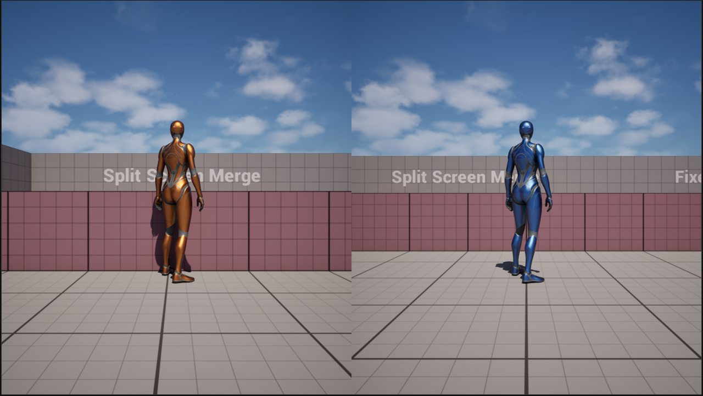 | 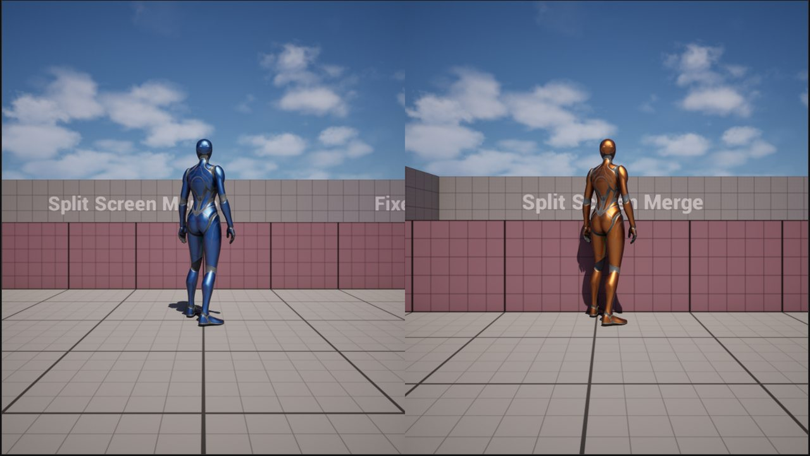 |

## Contents

- [Installation](#installation)
- [Example project](#example-project)
- [How it works](#how-it-works)
- [Level volumes](#level-volumes)
- [Blueprint / C++ API](#blueprint--c-api)
- [Settings](#settings)
- [Multiplayer testing](#multiplayer-testing)
- [Troubleshooting](#troubleshooting)

## Installation

1. Install **Dynamic Split Screen** from Fab into your engine (Fab > My Library > Install to Engine),
   or copy the `DynamicSplitScreen` plugin folder into `<YourProject>/Plugins/`.
2. Enable it in **Edit > Plugins** (search *Dynamic Split Screen*) and restart the editor.
3. Set **Project Settings > Engine > General Settings > Default Classes > Game Viewport Client Class**
   to `DynamicSplitScreenViewportClient`, or add to `Config/DefaultEngine.ini`:
   ```ini
   [/Script/Engine.Engine]
   GameViewportClientClassName=/Script/DynamicSplitScreen.DynamicSplitScreenViewportClient
   ```
4. Make your GameMode inherit from `DynamicSplitScreenGameMode` and your PlayerController from
   `DynamicSplitScreenPlayerController` (Blueprints can pick them as parent classes).
5. Use a character with a `SpringArmComponent` and a `CameraComponent`, such as the Third Person
   template character. No other character changes are needed.

Engine modules used: Core, CoreUObject, Engine, RenderCore, Slate, SlateCore.

## Example project

**Download:** [DynamicSplitScreen_ExampleProject.zip](https://github.com/rohyunsang/SplitScreen/releases/latest/download/DynamicSplitScreen_ExampleProject.zip)

The example project does not contain the plugin itself.

1. Install **Dynamic Split Screen** from Fab into Unreal Engine 5.8 (see Installation, step 1).
2. The example has a small C++ game module, so Visual Studio 2022 with the *Game development with C++*
   workload is required. When you open the project, click **Yes** to build the missing module.
3. Open `SplitScreen.uproject`. The demo map `/Game/DynamicSplitScreenDemo/Maps/DynamicSplitScreenMap` opens.
4. Press **Play**. The project is preset to **Net Mode: Play As Listen Server** with **2 players**,
   so two windows open (host and client).
5. Move with **W A S D**, look with the mouse, jump with **Space**, and walk onto the coloured pads.
   Player 1 (host) is blue, Player 2 (client) is orange.

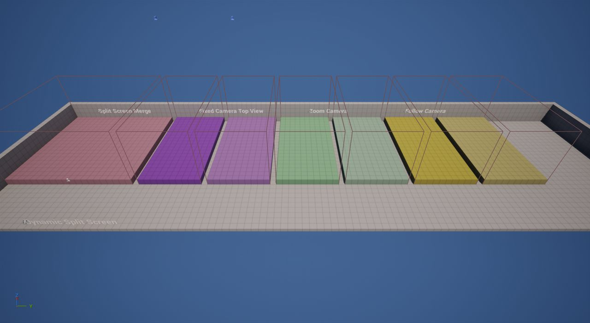

From left to right: Split Screen Merge (pink), Fixed Camera (purple), Camera Zoom (green),
Follow Camera (yellow). The lighter pad of each pair also switches the screen to full view.
Pressing Play in Standalone shows a reminder, because split screen needs two networked players.

## How it works

| Class | Role |
|---|---|
| `DynamicSplitScreenCameraProxy` | Replicated actor per player carrying camera location, rotation, FOV and spring-arm length. The host fills its own; clients send theirs through an unreliable RPC at 60 Hz. |
| `DynamicSplitScreenSubsystem` | Game instance subsystem. Finds the other player, smooths their camera, sweeps it against walls, runs split / full-screen transitions. |
| `DynamicSplitScreenViewportClient` | Renders your own view plus a second scene view for the other player in one ViewFamily. No dummy LocalPlayer / PlayerController / SpectatorPawn, so HUD, audio, texture streaming and upscalers keep working. |

`DynamicSplitScreenGameMode` spawns the proxies and enables split screen on the host when the second
player joins; `DynamicSplitScreenPlayerController` enables it on the client.
A transition changes only the screen of the machine whose player triggered it.

## Level volumes

Blueprints are in **DynamicSplitScreen Content > Blueprints > Volumes**. Drop one into the level and
scale its box. Overlaps are counted per character and full-screen requests are reference counted,
so overlapping volumes hand over cleanly.

### Split Screen Merge Volume

Merges into one full view when enough players (local or remote) are inside; every machine shows its
own player.

| Host screen | Client screen |
|---|---|
| 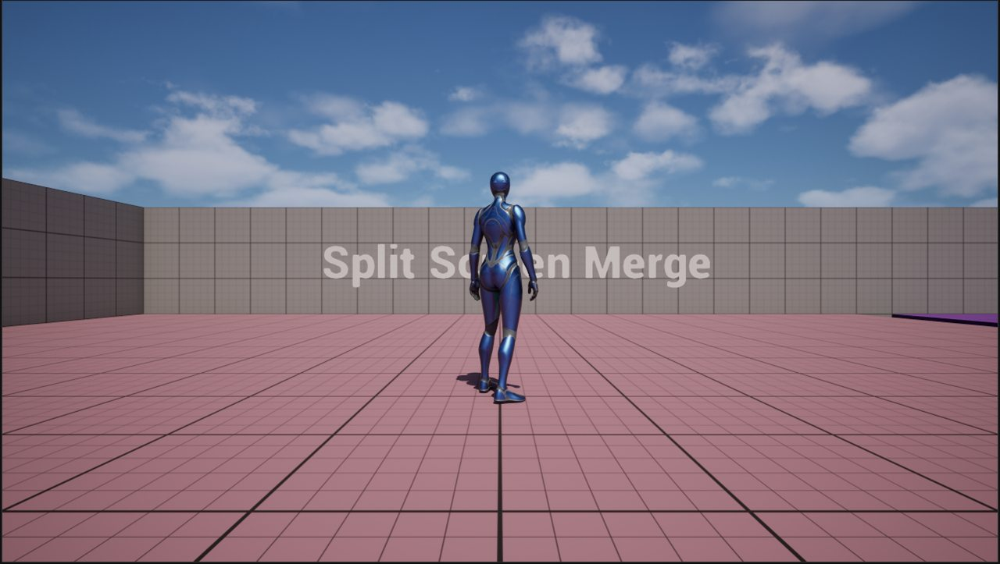 | 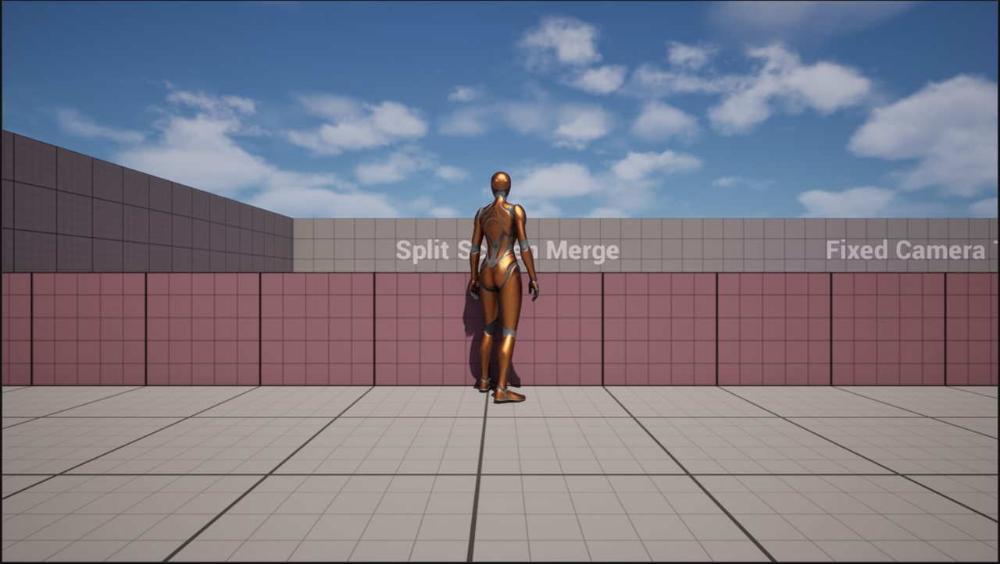 |

| Property | Default | Meaning |
|---|---|---|
| `PlayersRequiredToMerge` | 2 | 1 = merge when anyone enters, 2 = only when both are inside |
| `bRestoreOnAnyPlayerExit` | true | Restore as soon as the count drops below the requirement |

### Fixed Camera Volume

Switches the entering player to the volume's camera, blends the control rotation and locks look input.
The other player's screen mirrors that camera.

| Host screen | Client screen |
|---|---|
| 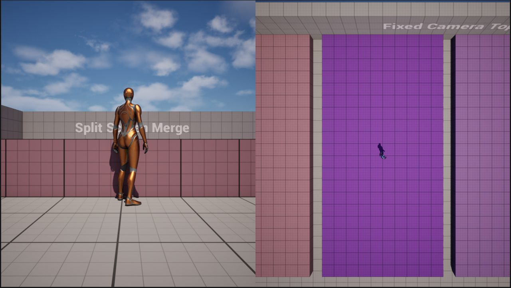 | 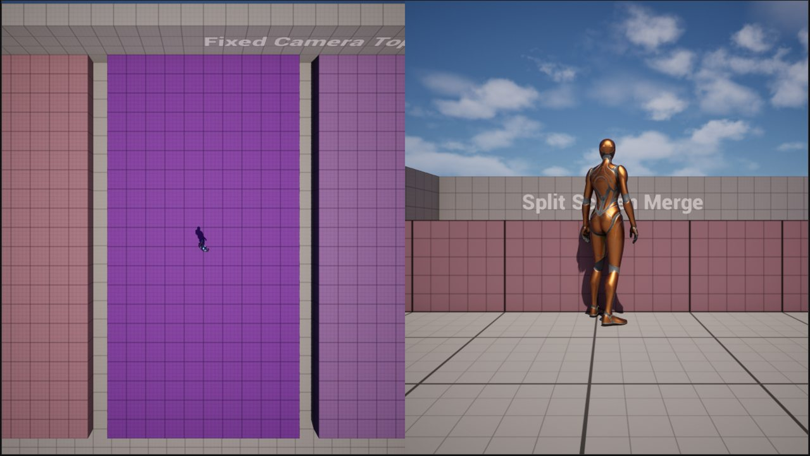 |
| 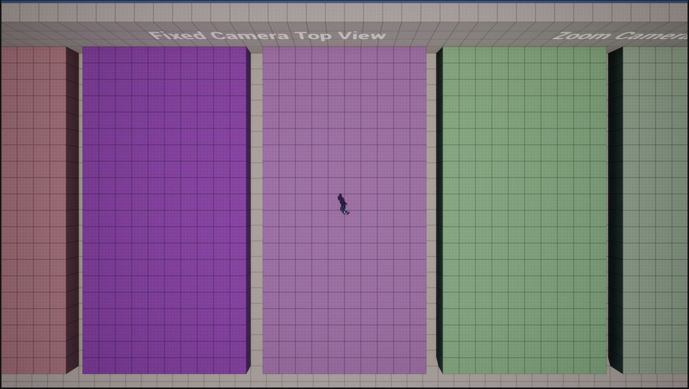 | 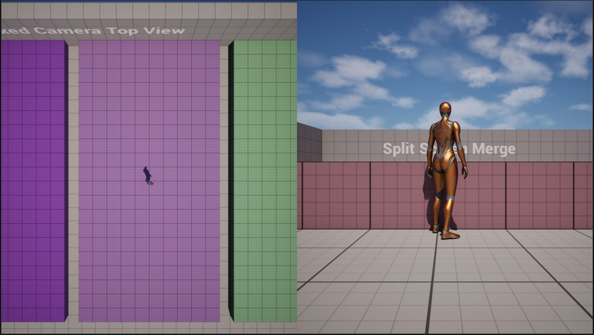 |

| Property | Default | Meaning |
|---|---|---|
| `FixedCamera` | component | Position and rotate it to frame the shot |
| `BlendTime` | 0.75 s | Camera blend in / out |
| `FixedControlRotation` | (0,0,0) | Control rotation inside the volume ("forward") |
| `ControlRotationBlendTime` | 0.75 s | Control rotation blend |
| `bRestoreControlRotationOnExit` | false | false keeps the current yaw on exit |
| `bUseSplitScreenTransition` | false | Also go full screen while inside |
| `bFullScreenForEnteringPlayer` | true | React to the player this machine controls |

### Camera Zoom Volume

Blends the spring-arm length and back on exit. The other player sees the zoom too.

| Host screen | Client screen |
|---|---|
| 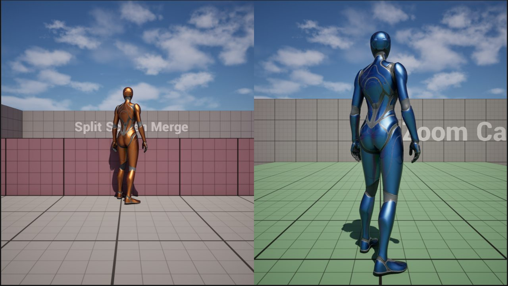 | 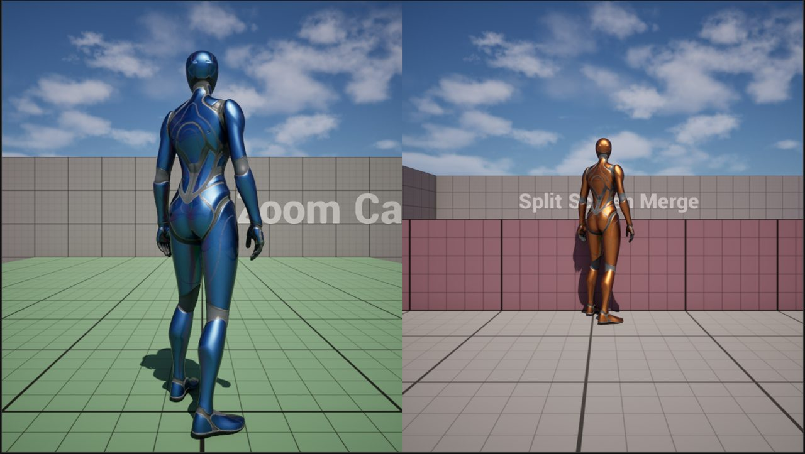 |
| 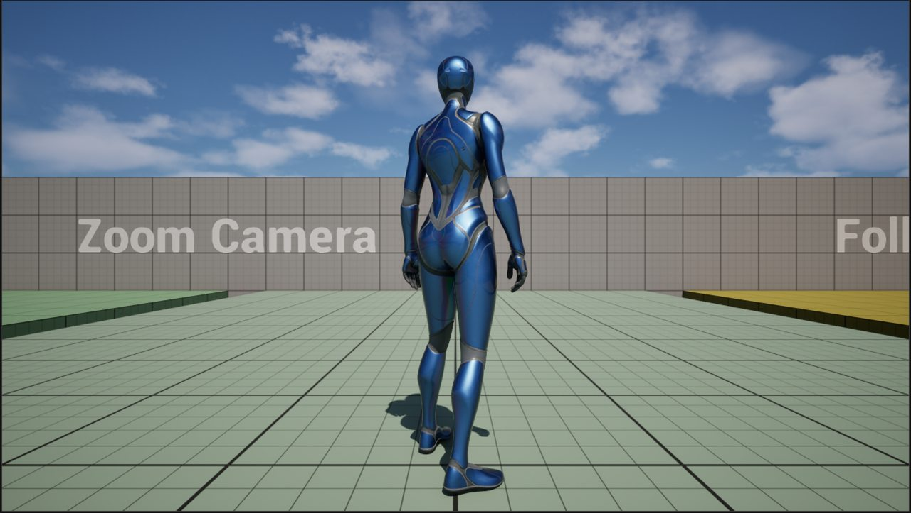 | 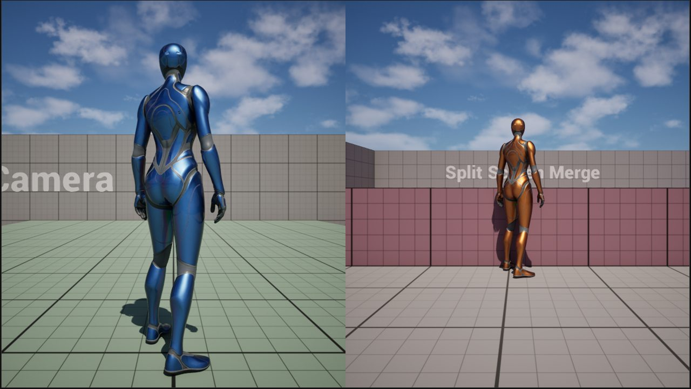 |

| Property | Default | Meaning |
|---|---|---|
| `TargetArmLength` | 200 | Arm length inside the volume |
| `ZoomInterpSpeed` | 5 | Zoom interp speed |
| `bUseSplitScreenTransition` | false | Also go full screen while inside |

### Follow Camera Volume

A camera that follows the character at a fixed offset and angle (side-scroller / top-down).

| Host screen | Client screen |
|---|---|
| 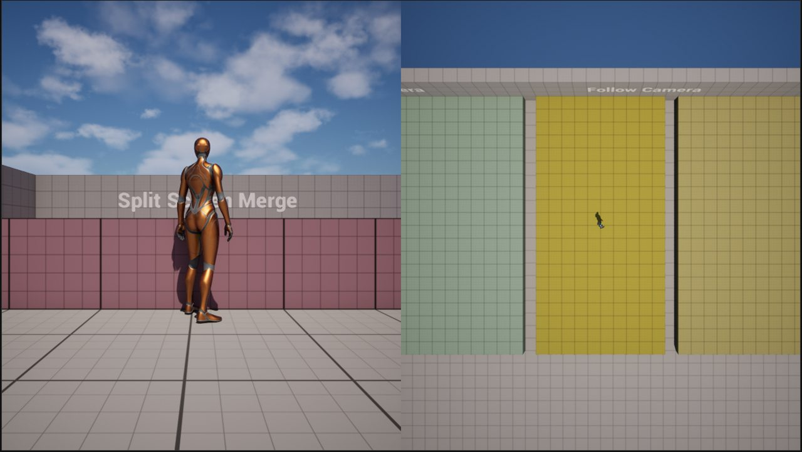 | 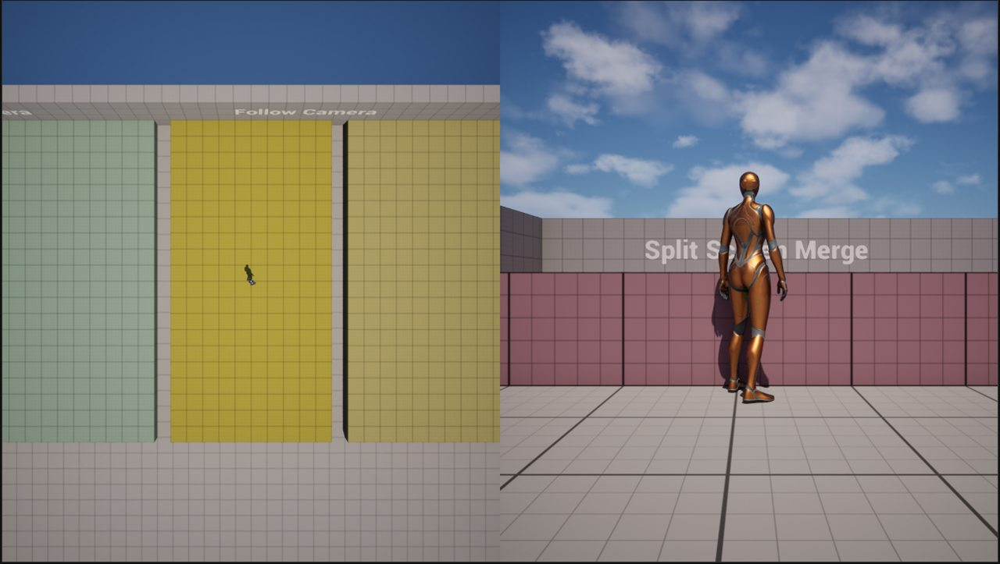 |
| 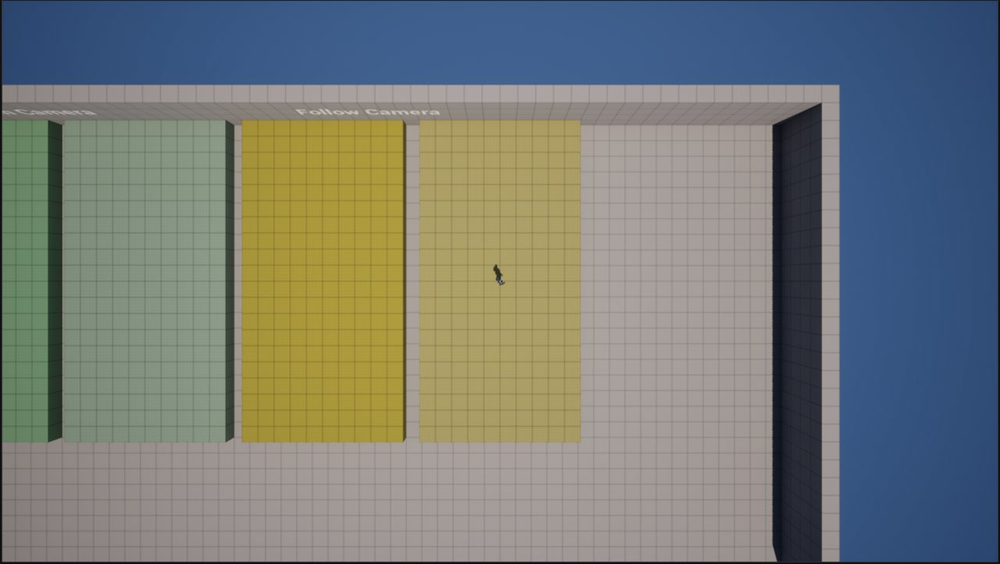 | 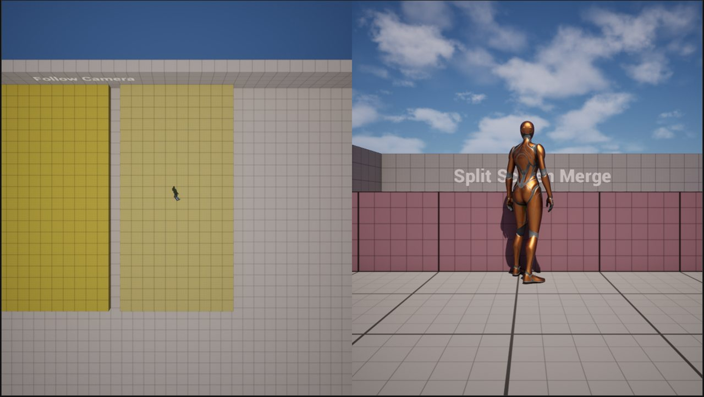 |

| Property | Default | Meaning |
|---|---|---|
| `FollowOffset` | (-500,0,300) | Offset from the character |
| `FixedCameraRotation` | (-20,0,0) | Camera rotation (demo: pitch 270, straight down) |
| `bFollowCharacterYaw` | false | Rotate the offset with the character |
| `bIgnoreLookInput` | true | Lock mouse look while inside |
| `bUseSplitScreenTransition` | false | Also go full screen while inside |

### Split Screen Transition Trigger

Local player inside → this screen goes full view. Changes no camera. Add it from **Place Actors**.

## Blueprint / C++ API

Use **Get Game Instance Subsystem** (`DynamicSplitScreenSubsystem`), category *Dynamic Split Screen*.

| Function | What it does |
|---|---|
| `EnableSplitScreen` / `DisableSplitScreen` | Start / stop drawing the other player's view |
| `IsSplitScreenEnabled` | True while split screen is active |
| `TransitionToFullScreen` / `TransitionToSplitScreen` | Animate this machine's view |
| `IsInFullScreenMode` | True once the full-screen transition finished |
| `SetMainViewOnRight` | Which side shows your own view (default right) |
| `StartScreenFade` | Fade both halves to black (1) or back (0) |

From C++ prefer `RequestFullScreen(this)` / `ReleaseFullScreen(this)`.

## Settings

```ini
; Config/DefaultGame.ini
[/Script/DynamicSplitScreen.DynamicSplitScreenSubsystem]
TransitionDuration=0.5
RotationInterpSpeed=45
LocationInterpSpeed=25
AnchorInterpSpeed=60
ArmLengthInterpSpeed=30
FOVInterpSpeed=12
SnapDistance=1500
bDoCollisionTest=True
ProbeSize=12
bMainViewOnRight=True
```

GameMode and PlayerController have `bAutoEnableSplitScreen` (default true); the camera proxy has
`SendRate` (default 60 Hz). Console: `DynamicSplitScreen.DebugDraw 1`.

## Multiplayer testing

1. Play options (⋮ next to Play): **Number of Players = 2**, **Net Mode = Play As Listen Server**.
2. Play mode **New Editor Window (PIE)** gives each player a window.
3. Packaged: start one copy with `MyMap?listen`, connect the other with `open <host-ip>`.

Designed for exactly two players on a listen server; dedicated servers are not supported.

## Troubleshooting

- **Only one view** — you are in Standalone or with one player. Use Listen Server with 2 players.
- **Log: "Game Viewport Client Class is not DynamicSplitScreenViewportClient"** — set it (Installation, step 3) and restart.
- **Other half stays empty** — the GameMode (or the map's World Settings override) does not inherit from `DynamicSplitScreenGameMode`.
- **Other player's camera clips through walls** — level geometry must block the `ProbeChannel` (Camera).
- **A volume changed my screen but not my partner's** — intended; use the Merge Volume for both.
